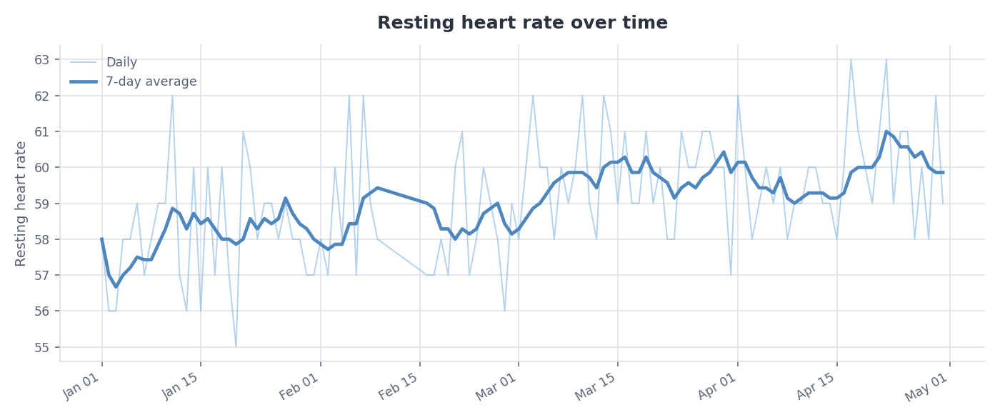
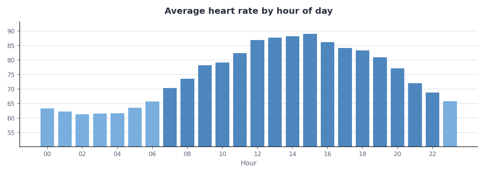

# Apple Health Insights

Turn the `export.xml` file Apple Health gives you into readable statistics, charts and a report you could hand to a doctor — **without loading gigabytes of XML into memory.**

Pure Python for parsing and analysis (no dependencies), matplotlib only for charts.

```bash
python -m healthinsights.cli summary export.xml
python -m healthinsights.cli episodes export.xml --threshold 150
python -m healthinsights.cli report export.xml -o my-report
```

---

## The problem this solves

Apple Watch samples your heart rate every few seconds, forever. Export a few years of that and `export.xml` lands somewhere between a few hundred megabytes and a couple of gigabytes, holding millions of `<Record>` elements.

The obvious approach dies immediately:

```python
tree = ElementTree.parse("export.xml")   # builds the whole document in RAM
```

On a 1.5 GB export that's several gigabytes of memory and, on most laptops, a killed process.

This tool never holds the document. It uses `iterparse` to receive elements as they close, converts each into a small frozen dataclass, then **deletes the element and its finished siblings** so the tree behind it never accumulates.

**Measured on this machine:**

| Input | Records | Peak RAM |
| --- | ---: | ---: |
| 3.2 MB export | 18,390 | 0.49 MB |
| 33.2 MB export | 192,362 | **0.17 MB** |

A 10× larger file used *less* peak memory. That isn't a fluke — memory here is a function of what you keep, not how big the input is, so it stays flat whether you feed it 3 MB or 3 GB.

---

## Try it in 30 seconds

No Apple Watch required — a generator ships with the repo, because real exports contain someone's medical history and don't belong in a public repository.

```bash
git clone https://github.com/sydneygahunia-wq/apple-health-insights.git
cd apple-health-insights
pip install -r requirements.txt

python examples/generate_sample_data.py --days 120 --out sample_export.xml
python -m healthinsights.cli summary sample_export.xml -q
```

```
File size:          3.2 MB
Elements seen:      18,510
Records kept:       18,390
Skipped (untracked): 116
Skipped (malformed): 4
Untracked types:    HKQuantityTypeIdentifierDietaryCaffeine, SleepAnalysis/InBed

Metric                          n      mean    median       p95   days
----------------------------------------------------------------------
Heart rate                 16,488      74.8      73.0      92.0    120
Resting heart rate            114      59.1      59.0      62.0    120
Sleep                         114       7.1       7.0       8.9    120
Steps                       1,674     569.9     540.5    1139.1    120

Resting heart rate trend: +0.6 BPM per month
Coverage gaps: 1 (6 days with no readings)
```

The sample generator deliberately injects a `+0.02 BPM/day` drift and a six-day stretch of missing data. The analysis recovers both — `+0.6 BPM per month` and one 6-day gap — which is the point of testing against synthetic data with known ground truth.

---

## What it reports

**Every element is accounted for.** Kept, skipped as an untracked type, or rejected as malformed — the three always sum to the total. A summary that quietly drops a third of the file while sounding confident is worse than no summary.

**Sustained episodes, not spikes.** A raw maximum is nearly useless on wrist data; one loose-strap artefact will dominate it. `episodes` finds *runs* of consecutive readings above a threshold, splitting on gaps so readings hours apart don't merge into a single fictional event.

```
Sustained runs at or above 150 BPM (3+ consecutive readings): 11

Start                 Duration   Peak   Mean     n
--------------------------------------------------
2026-02-01 14:21            6m    192    172     7
2026-02-27 11:21            4m    195    189     5
```

**Coverage gaps are surfaced.** A "90-day average" that's really 31 days of wear and 59 days in a drawer is misleading, so missing stretches get named rather than silently averaged over.

**Associations, never causes.** The report pairs each night's sleep with the *next* morning's resting heart rate and states the correlation with its sample size attached — and flags it as a hint rather than a finding when there aren't enough days. With observational data from a wrist sensor, association is the honest ceiling.

---

## Example output



Raw daily values sit faint behind a 7-day rolling average, because on day-to-day wrist data the noise is genuinely larger than the trend.



Full worked example: **[docs/example-report.md](docs/example-report.md)**

---

## Architecture

Three layers that never reach into each other:

```
healthinsights/
├── records.py    value types — HealthRecord, RecordType
├── parser.py     the only module that knows what XML looks like
├── analysis.py   pure functions: records in, numbers out
├── charts.py     the only module that imports matplotlib
├── report.py     assembles the narrative
└── cli.py        argument parsing and formatting only
```

The separation is what makes the project testable. `analysis.py` has no I/O and no plotting, so every statistic can be checked against a hand-built list of records and a hand-computed answer. `charts.py` selects the Agg backend explicitly so nothing needs a display.

Two design details worth calling out:

`HealthRecord` uses `slots=True`. A multi-year export holds millions of heart-rate samples, and dropping the per-instance `__dict__` roughly halves memory.

`RecordType.is_cumulative` decides whether a day's readings are summed or averaged. Steps accumulate; heart rate doesn't. Getting that backwards gives you a resting heart rate of 40,000 — obvious in a chart, invisible in a test that only checks the code runs.

---

## Tests

```bash
python -m unittest discover -s tests -v
```

**55 tests, all passing.** The parser tests are mostly about bad input, because real exports are full of it — non-numeric values, wrong-format timestamps, record types Apple added later, rows in no particular order. A parser that only works on clean data is a demo, not a parser.

The analysis tests assert against hand-computed values rather than whatever the code returned first. A parser bug announces itself with a crash; a statistics bug produces a plausible wrong number nobody questions.

Cases worth a look: an isolated 190 BPM spike must *not* register as an episode; two high readings eight hours apart must not merge into one; a correlation over two points returns `None` rather than a confident 1.0.

---

## Privacy

`export.xml` is medical data. It never leaves your machine — there is no network code in this project at all, and `.gitignore` blocks `export.xml` and `apple_health_export/` so you can't commit yours by accident.

To get your own: **Health app → profile picture → Export All Health Data**.

---

## Related

The episode-detection approach here is a descendant of [svt-monitor](https://github.com/sydneygahunia-wq/svt-monitor), an iOS app I built to track SVT episodes — same reasoning about sustained runs versus spikes, applied retrospectively to exported data instead of a live stream.

---

## License

MIT — see [LICENSE](LICENSE).

> Not a medical device. This describes exported sensor data; it does not diagnose anything. Talk to a clinician about symptoms.
