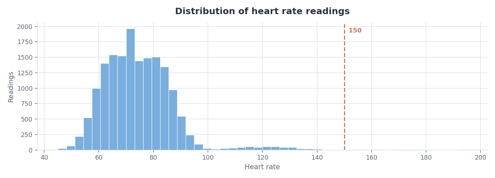
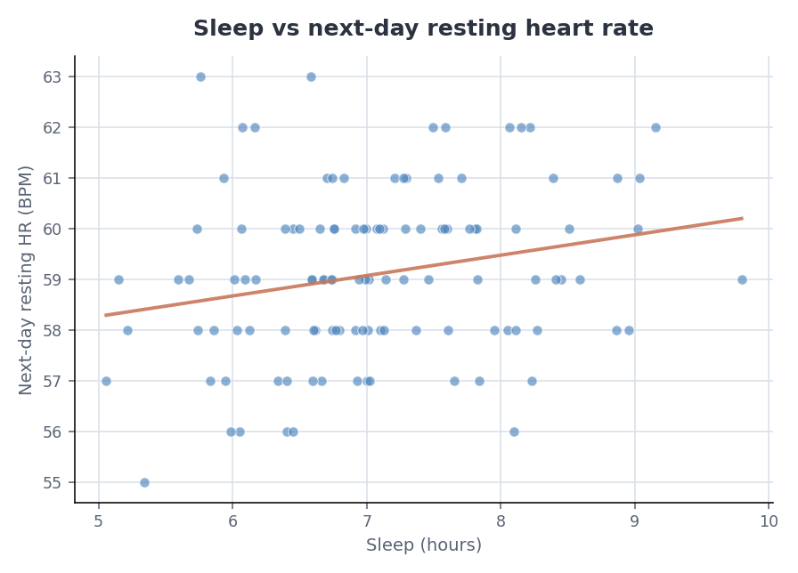
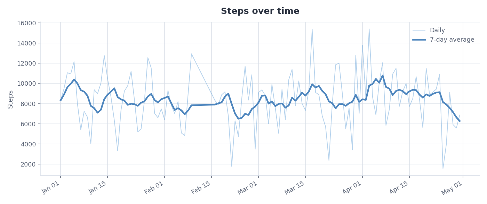

# Apple Health report

Generated 2026-07-25 14:39 by [apple-health-insights](https://github.com/sydneygahunia-wq/apple-health-insights).

> This is a descriptive summary of exported sensor data. It is not a medical assessment, and nothing here diagnoses anything. Associations between metrics are just that — associations.

## What was read

```
File size:          3.2 MB
Elements seen:      18,510
Records kept:       18,390
Skipped (untracked): 116
Skipped (malformed): 4
Untracked types:    HKQuantityTypeIdentifierDietaryCaffeine, SleepAnalysis/InBed
```

## Metrics

| Metric | Readings | Mean | Median | 5th–95th | Days |
| --- | ---: | ---: | ---: | :---: | ---: |
| Heart rate | 16,488 | 74.8 | 73.0 | 57.0–92.0 | 120 |
| Resting heart rate | 114 | 59.1 | 59.0 | 56.6–62.0 | 120 |
| Sleep | 114 | 7.1 | 7.0 | 5.7–8.9 | 120 |
| Steps | 1,674 | 569.9 | 540.5 | 107.7–1139.1 | 120 |

## Resting heart rate

Trend: **rising 0.6 BPM per month** (+0.020 BPM/day, least-squares fit over 114 days).

Coverage: 1 gap(s) totalling 6 days with no readings — averages above exclude those days rather than treating them as zero.


## Heart rate



Quietest hour is **02:00** (61 BPM); busiest is **15:00** (89 BPM).


### Sustained readings at or above 150 BPM

Found **11** run(s) of at least 3 consecutive readings. Isolated spikes are excluded, since a single high reading from a loose strap is far more common than a real one.

| Start | Duration | Peak | Mean | Readings |
| --- | ---: | ---: | ---: | ---: |
| 2026-01-02 13:41 | 2 min | 183 | 176 | 3 |
| 2026-02-01 14:21 | 6 min | 192 | 172 | 7 |
| 2026-02-27 11:21 | 4 min | 195 | 189 | 5 |
| 2026-03-02 15:20 | 6 min | 193 | 182 | 7 |
| 2026-03-20 12:01 | 5 min | 180 | 173 | 6 |
| 2026-03-31 13:00 | 7 min | 194 | 176 | 8 |
| 2026-04-02 12:01 | 4 min | 186 | 177 | 5 |
| 2026-04-09 12:41 | 3 min | 190 | 186 | 4 |
| 2026-04-11 09:00 | 7 min | 188 | 168 | 8 |
| 2026-04-17 15:40 | 8 min | 180 | 174 | 9 |
| 2026-04-22 19:01 | 2 min | 187 | 174 | 3 |

## Sleep and the following morning

Each night's sleep duration paired with the **next** morning's resting heart rate: weak positive association (r = +0.23, n = 114).

_Association only. Plenty of things move both numbers at once — illness, alcohol, stress, a hard workout the day before._



## Steps

Weekdays average **9,107** steps; weekends **6,476**.


